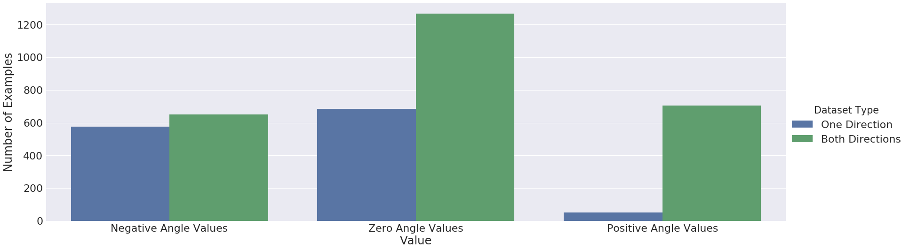
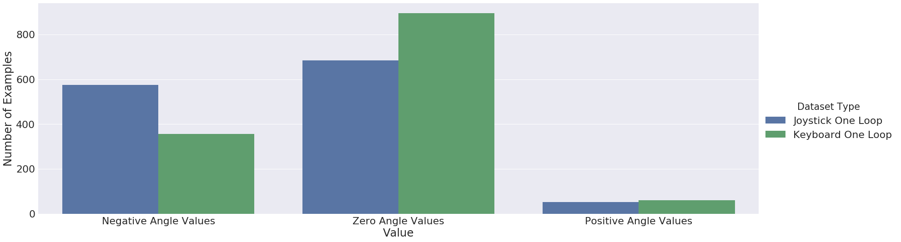
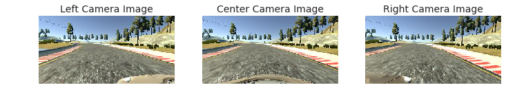
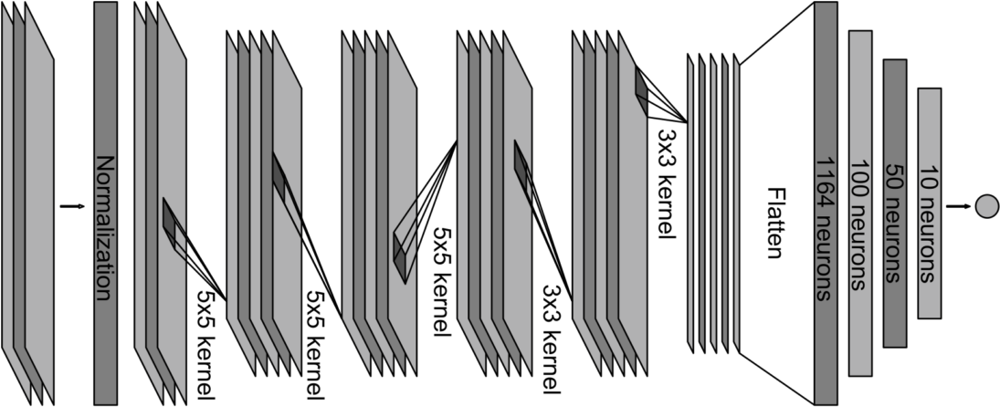
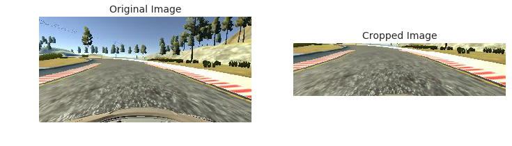
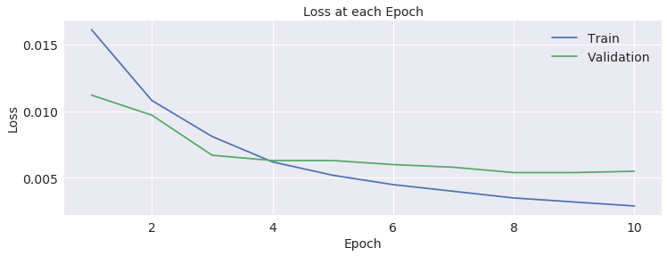

# Behavioral Cloning Project

This project aims an end-to-end approach by training a convolutional neural network (CNN) to drive a car in a simulation. This project is a part the first term of Udacity's [self-driving car engineer nanodegree](https://www.udacity.com/drive) program. For inspiration, please also refer to these amazing previous works: [DAVE from DARPA Autonomous Vehicle](http://net-scale.com/doc/net-scale-dave-report.pdf) and [DAVE-2 from NVIDIA](https://devblogs.nvidia.com/parallelforall/deep-learning-self-driving-cars/).

The steps of the project are:

* Drive a car in a simulation properly and collect image data from center, left and right cameras.

* Build a convolutional neural network in Keras and train the model to predict the steering angles from images.

* Test the model for driving successfully in the simulation without leaving the road.

For the model, generator and training implementations please refer to this [file](./model.py).

## Dataset

Since the model will learn to drive from a human driver behaviour, properly driving the car in the [simulation](https://github.com/udacity/self-driving-car-sim) was an important issue. After practising the simulation, car was carefully driven around the track one for about five times. Since the track one has more left turns, in order to avoid unbalanced steering angle examples, car is additionally driven for about five times in the opposite direction.

A distribution of steering angle values is given below for one direction and both.

As can be seen from the figures, driving for only one direction causes unbalanced steering examples.

In addition, the car is driven using a joystick (Logitech Extreme 3D Pro Joystick) in order to get smooth steering angle values by avoiding discrete and sharp ones. Driving the car with a keyboard causes sharp and descrete values and the steering data becomes unbalanced by having more steering examples with the value of zero. Below, a steering value distribution for a keyboard and a joystick is given.

As can be seen from the figures, there are more steering examples with the value of zero when a keyboard is used.

By driving the car in both directions for about ten loops in total, three road images from left, center and right cameras along with steering, throttle, breake and speed values are recorded. Some examples from these camera images are given below.

## Model Architecture

The power of convolutional neural networks are used for modelling this end-to-end learning approach. And the same CNN architecture from [NVIDIA's original DAVE-2 work](https://devblogs.nvidia.com/parallelforall/deep-learning-self-driving-cars/) is used for this project. This architecture is given below.

Credits [NVIDIA DAVE-2](https://arxiv.org/pdf/1604.07316v1.pdf)

As can be seen from the figure, the model has three input channels. NVIDIA uses three color channels from YUV space. However, since the tract one has no difficult lighting conditions, RGB color channels are used as input in the project.

Additionally, in order to avoid any distruction from unnecessary areas in the images, the top and the bottom of the input images are cropped leaving only the road view. An example is given below for cropping the input.

The original images are in a size of 320x160x3 and after the cropping the input size becomes 320x80x3.

After the input cropped and normalized, the model has five convolutional layers. The first three layers have 5x5 and the following two have 3x3 kernel size. The number of kernels for these layers are 24, 36, 48, 64 and 64 from first to fifth layers respectively. The fifth convolutional layer is flattened and connectected to a dense layer with 100 neurons. And then, the following two additional dense layers have 50 and 10 neurans respectively. The final layer has only one neuron and outputs the steering angle values.

Since the dataset does not have a rich variety of examples from different tracks, dropout (with 0.5 ratio) is applied after the flattened output of the fifth convolutional layer and the dense layers with 100 and 50 neurons in order to avoid overfitting. If a dropout is applied after the dense layer with 10 neurons, model underfits due to small number of neurons in this layer. Thus, no dropout is applied after this layer.

All of the convolutional layers and the dense layers have RELU activations applied to their outputs. Additionally, since the first three convolutional layer kernels have 2x2 strides, no max pooling operation is needed on the model. 

## Training the Model

Since the dataset has too many image examples (9529 examples for training and 4085 examples for validation plus left and right camera images for each example), it is impossible for a GPU memory to load the whole images at once. Thus, a generator is implemented in order to load the batches of images in each step at training time.

### The generator

A GPU of NVIDIA Geforce GT 650M with 4GB memory is used on an ASUS laptop for training. With a GPU of this memory capacity, it was convenient to train the model with batches of 600 images at each step. Thus, the generator loads 200 left, 200 center and 200 right image examples at each step.

The left and the right camera images are used as if they are center camera images for tuning the steering angle values to keep the car in the track. For this purpose, a steering angle value to pull the car back to the center is obtained by tuning the true center steering angle values. A correction value of 0.2 is added to the true steering values for any left camera images and the same correction value is subtracted from the true steering values for any right camera images in order to calculate the desired new steering angle values. This procedure has led to an augmentation of the dataset for keeping the car at the center of the road. As the result, at each step 200 left images, 200 center images and 200 right images are chosen and loaded in the batch randomly.

### Optimization

Since the aim of the project is to teach the model the steering angle values from road images, the output has only one neuron with mean square error function as the cost function. And the model trained using an adaptive method called [Adam](https://arxiv.org/abs/1412.6980) for stochastic optimization. This optimization method helps easily optimize the model without the effort of hyperparameter tuning.

### Number of epochs

After one epoch of training, the model is able to complete the tract successfully. However, in order to avoid the wobbling of the car, model trained for ten epochs and the weights with the lowest validation loss is chosen for testing. The validation and train losses are given below for each epoch.

The [weights](./saved-models) after the ninth epoh is used for testing the model.

## Testing the Model in the Simulation

After the training, the model tested on track one in the simulation. As the result, car learns to drive successfully around the track. For the video record please refer to this [youtube link](https://youtu.be/C85PP9o9Cx8).

## Reflections

After each epoch, shuffling the examples before choosing the batch really helps the model to generalize. Feeding the batch examples in the same order after each epoch causes model to train poorly.

In addition, the speed of the car is held constant at 20 mph, since the car wobbles at high speeds due to the fixed correction value added to the true steering values for the left and right images. A better approach can be achieved by implementing a [pid controller](https://en.wikipedia.org/wiki/PID_controller) which additionally needs the cross track error information. However, this approach will be implemented in another project in the second term.